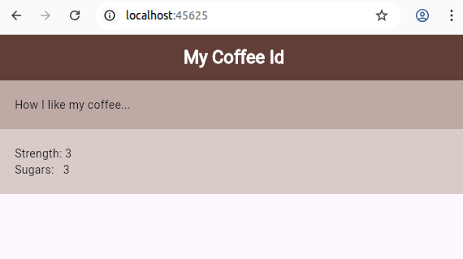
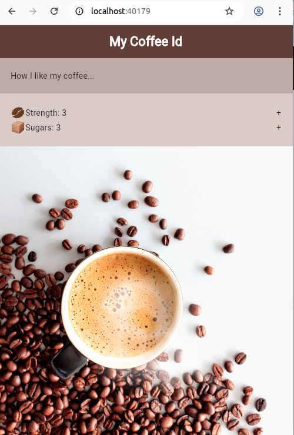

# flutter-vscode-super-proj
project that contains flutter example


#### nna12_row_widget
- Usage of rows and columns - marginal styling



#### nna14_expanded_widget
- Fill left-over space with a background image
```
  ...
      Expanded(
            // note: fill the remaining background with a bg-image
            //    and adjust the image
            child: Image.asset(
              'assets/img/coffee_bg.jpg',
              fit: BoxFit.fitWidth,
              alignment: Alignment.bottomCenter,
            ),
          ),
  ...
```  
        