# flutter-vscode-super-proj
project that contains flutter example


#### nna12_row_widget
- Usage of rows and columns - marginal styling


#### nna14_expanded_widget
- Fill left-over space with a background image
```
  ...
      Expanded(
            // note: fill the remaining background with a bg-image
            //    and adjust the image
            child: Image.asset(
              'assets/img/coffee_bg.jpg',
              fit: BoxFit.fitWidth,
              alignment: Alignment.bottomCenter,
            ),
          ),
  ...
```  
        

#### nna15_buttons 
- add buttons and custom styles coffee_prefs.dart
https://docs.flutter.dev/ui/widgets/material#actions

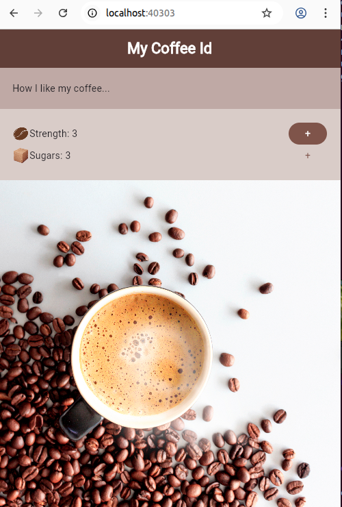


#### nna16_stateful_widget and nna17_conditional_rendering
- stateful widget and conditional rendering

```
...
  @override
  Widget build(BuildContext context) {
    return Column(
      children: [
        Row(
          children: [
            const Text('Strength: '),
            Text("$strength  "),

            if (strength == 0) Text("Really Weak"),  // conditional rendering

            for (int i = 0; i < strength; i++)   // conditional rendering
              Image.asset(
                'assets/img/coffee_bean.png',
                width: 25,
                colorBlendMode: BlendMode.multiply,
                color: Colors.brown[100],
              ),
            const Expanded(child: SizedBox(width: 100)),
            FilledButton(
              style: FilledButton.styleFrom(
                backgroundColor: Colors.brown,
                foregroundColor: Colors.white,
              ),
              onPressed: increaseStrength,
              child: const Text('+'),
            ),

```
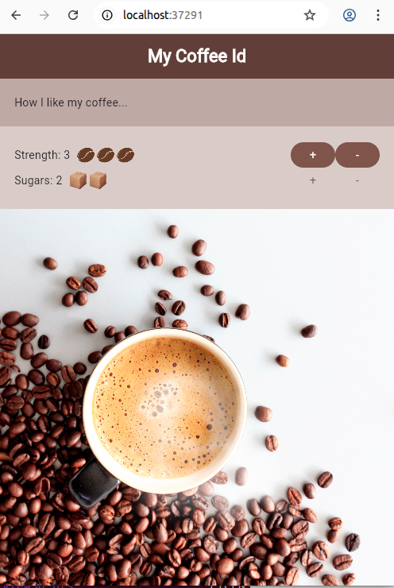


#### nna18_reusable_widget
- Pass parameters to custom widgets to ensure reusablility and DRY principle
- see [class StyledBodyText](./nna18_reusable_widget/lib/styled_body_text.dart)
- see [class StyledButton](./nna18_reusable_widget/lib/styled_button.dart)


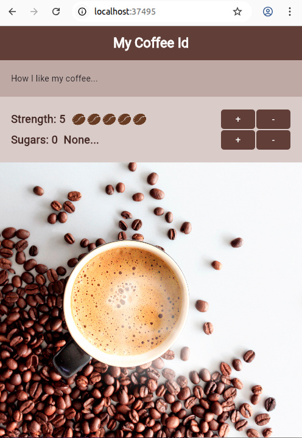


#### nna21_theme_custom
- Define custom theme
- Pass :parameter:"themePrimary" to MaterialApp's ctor

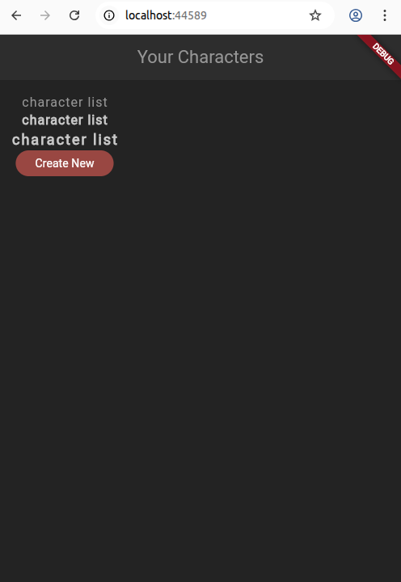


#### nna22_theme_shared
- Define custom widgets that use the custom theme
- Pass :parameter:"themePrimary" to MaterialApp's ctor

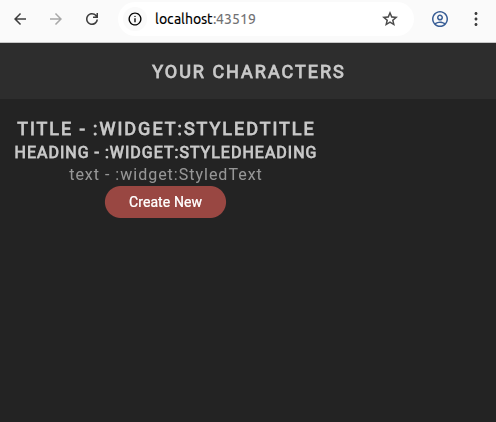


#### nna23_google_fonts
A. Using google fonts
  1. import google_fonts as a dependency in `pubspec.yml` <br/>
  ```bash
    flutter pub add google_fonts
  ```

  2. import google_fonts and use the factory method in a widget.
  ```dart
  import 'package:flutter/material.dart';
  import 'package:google_fonts/google_fonts.dart'; // 2. import googe_fonts

  class StyledText extends StatelessWidget {
    const StyledText(this.text, {super.key});

    final String text;

    @override
    Widget build(BuildContext context) {
      // 3. use GoogleFonts factory methos in :attr:"style"
      return Text(
        text, // --
        style: GoogleFonts.kanit(textStyle: Theme.of(context).textTheme.bodyMedium),
      );
    }
  }
  ```
  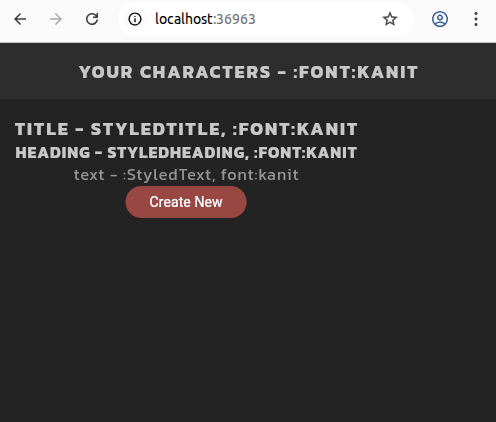


#### nna24_container_gradient
  - Create and use :custom_button_widget:"StyledButton"
  - StyledButton renders a child widget (e.g. StyledHeading('btn-text'))
  - StyledButton has a background-gradient and rounded corners
  - StyledButton uses EdgeInsets for padding
  - StyledButton is really a TextButton that contains a :styled_widget:child

  ```dart
    import 'package:flutter/material.dart';
    import 'package:nna24_container_gradient/theme.dart';

    class StyledButton extends StatelessWidget {
      const StyledButton({super.key, required this.onPressed, required this.child});

      final Function() onPressed;
      final Widget child; // e.g. StyledHeading('Btn-Text')

      @override
      Widget build(BuildContext context) {
        return TextButton(
          onPressed: onPressed,
          child: Container(
            padding: const EdgeInsets.symmetric(vertical: 10, horizontal: 20),
            decoration: BoxDecoration(
              gradient: LinearGradient(
                //      [start color, end color of gradient]
                colors: [AppColors.primaryColor, AppColors.primaryAccent],
                begin: Alignment.topCenter, // start location of gradient
                end: Alignment.bottomCenter, //  end location of gradient
              ),
              borderRadius: const BorderRadius.all(Radius.circular(5)),
            ),
            child: child,
          ),
        );
      }
    }

  ```
  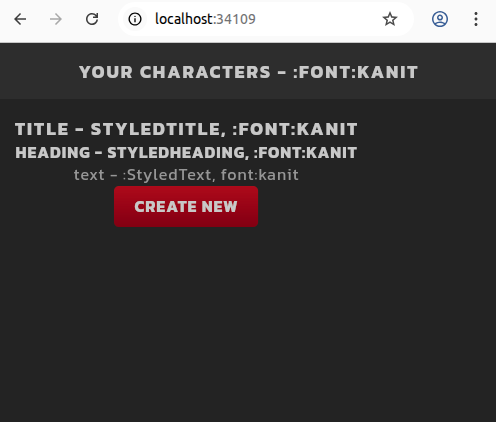


  #### nna25_listview 
    - see [ListView usage : https://docs.flutter.dev/cookbook/lists/long-lists](https://docs.flutter.dev/cookbook/lists/long-lists)
    - :widget:Expanded wraps :widget:ListView  to provide hint to Flutter Layout manager, because ListView is automatically scollable (so ListView has no inherent height).
    - ListView renders a list of items. 

    ```dart
    import 'package:flutter/material.dart';
    import 'package:nna25_listview/shared/styled_text.dart';
    import 'package:nna25_listview/shared/styled_button.dart';

    class Home extends StatefulWidget {
      const Home({super.key});

      @override
      State<Home> createState() => _HomeState();
    }

    class _HomeState extends State<Home> {
      List characters = ['R.Moore', 'D.Lydic', 'J.Oliver', 'J.Carlin', 'J.Klepper', 'K.Knowles'];

      @override
      Widget build(BuildContext context) {
        return Scaffold(
          appBar: AppBar(title: const StyledTitle('Your Characters - :font:kanit'), centerTitle: true),
          body: Container(
            padding: const EdgeInsets.all(16),
            child: Column(
              children: [
                Expanded(
                  // Need `Expanded` to help Flutter's layout manager,
                  // because ListView has unconstrained height.
                  // So :widget:"Expanded" must wrap :child:"ListView"
                  // because "ListView" is automatically scrollable.
                  child: ListView.builder(
                    itemCount: characters.length,
                    itemBuilder: (context, index) { // itemBuilder factory-function
                      return Container(
                        color: Colors.grey[800],
                        padding: const EdgeInsets.all(40),
                        margin: const EdgeInsets.only(bottom: 10),
                        child: StyledText(characters[index]),
                      );
                    },
                  ),
                ),
                StyledButton(
                  onPressed: () {
                    // @todo: navigate to the create screen
                  },
                  child: StyledHeading('Create New'),
                ),
              ],
            ),
          ),
        );
      }
    }

    ```

#### nna26_card_widget
  - see [Card - in https://docs.flutter.dev/ui/layout#card](https://docs.flutter.dev/ui/layout#card)
  - Create and use a custom reusable :widget:"CharacterCard"
  - [obsolete] cardTheme in In :file:theme.dart - specify a custom 'cardTheme'.
  - Specified reusable style in :widget:CharacterCard
  
  ```dart
  // file=nna26_card_widget/screens/home_screen/character_card.dart
  import 'package:flutter/material.dart';
  import 'package:nna26_card_widget/theme.dart' show AppColors;

  class CharacterCard extends StatelessWidget {
    const CharacterCard(this.character, {super.key});

    final String character;

    @override
    Widget build(BuildContext context) {
      return Card(
        color: AppColors.secondaryColor,
        surfaceTintColor: Colors.transparent,
        shape: const RoundedRectangleBorder(),
        shadowColor: Colors.transparent,
        margin: const EdgeInsets.only(bottom: 16),
        child: Padding(
          padding: const EdgeInsets.symmetric(horizontal: 16, vertical: 8),

          child: Row(children: [Text(character)]),
        ),
      );
    }
  }
  ```
  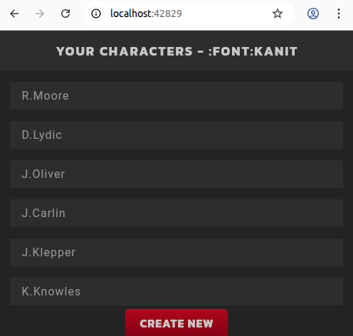
   
### nna27_icon_button
  - included in code, nna26_card_widget/lib/screens/home_screen/character_card.dart
  - add icon to rhs of each CharacterCard instance
  - for more icons - see https://fonts.googe.com/icons

  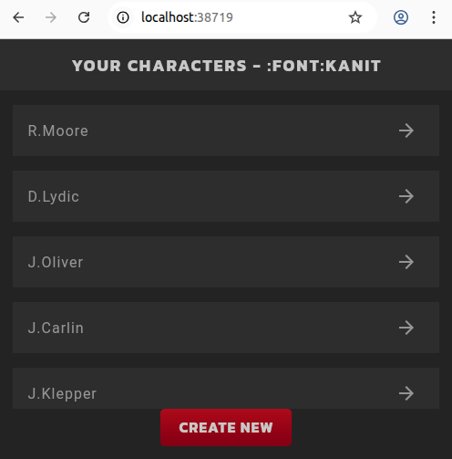

### nnna35_data_model_static
  - finish section on data model (culmination of lesson-26..lesson-35)
  - create a working app with character screen and proper layout.

  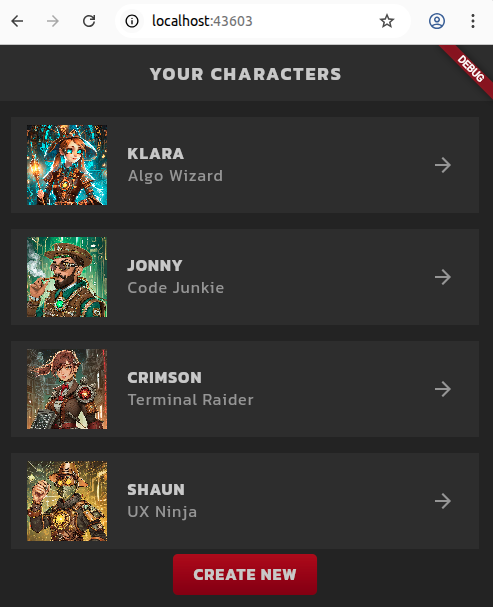


### nna37_text_field
   - includes code, lesson-36 and lesson-37, 38, 39
   - created a "create screen"
   - added text field with styling to create.dart
   - cursor custom style - to make cursor more visible and same color as text (harmony)

   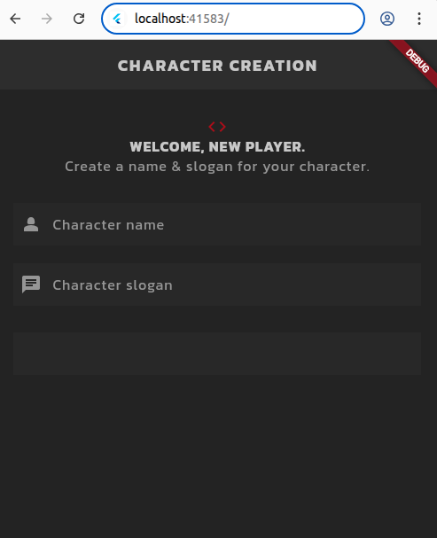

  - includes code, lesson-38 and lesson-39
  - Use text controllers correctly
  - Create an onSubmit callback
  
  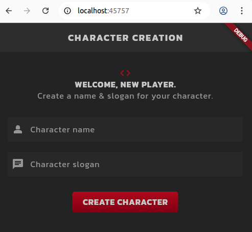

### nna44_select_list_vocation_and_submit
  - includes code from lessons; 40,41,42,43

  - lesson-40 - add vocation card (screens/create/vocation_card.dart)

  - lesson-41 - wrap vocation list in :widget:SingleChildScrollView 
    - a. to avoid content overflow warnings
    - b. make the list of vocations scrollable
    (see screens/create/create.dart)

   - lesson-42 onTap 

   - lesson-43 selection vocation (in list) and conditional styling of a VocationCard
   
   - lesson-44 submit (see screens/create/create.dart)
     - add the :package:uuid
       -`dart pub add uuid `
     - in create.dart's :method:handleSubmit -- create a new character object

  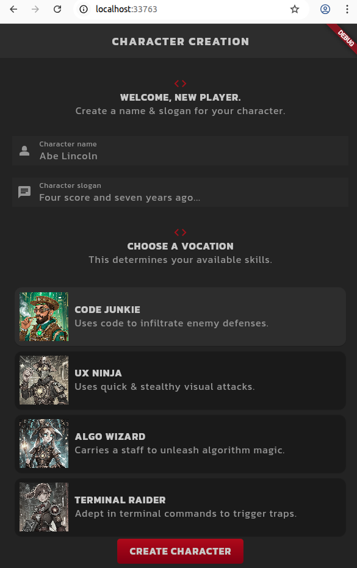        


  ### nna57_routes_and_screens
  - includes lessons 48..57
  - lesson-47 
    - (see screens/home/home.dart and screens/create/create.dart)
    - Navigator.push()  
  - lesson-48
    - showDialog(...) and AlertDialog - to signify response to validation errors (also navigation)
  - lesson-49 
    - style the the AlertDialog
  - lesson-50
    - create :screen:Profile
    - View character
      - Added navigation/route from :widget:CharacterCard to :screen:Profile
  - lesson-51 

  - post:lesson-49 - AlertDialog - on bad form data
    - 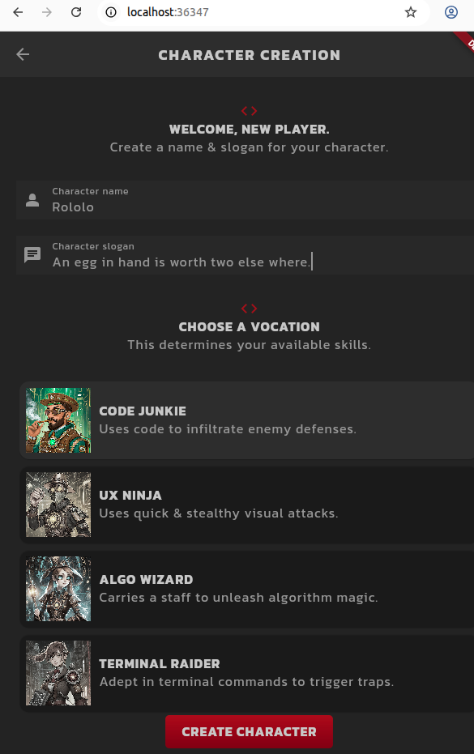
    - 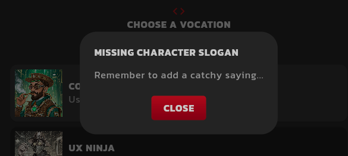

  - post:lesson-51 - navigate via :widget:CharacterCard to :screen-widget:Profile
    - 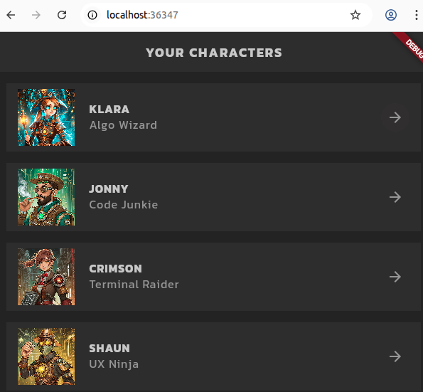
    - 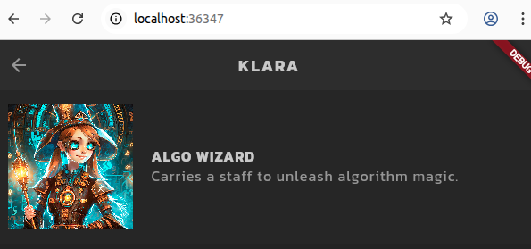

  - post:lesson-52 - added content to :widget-screen:Profile
    - 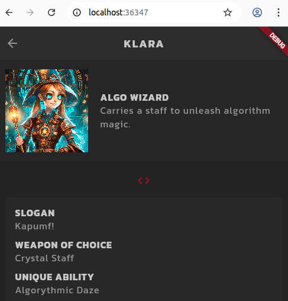

  - post:lesson-53 - create :StatfulWidget:StatsTable (that displays character info).
    - Used :context_reference:widget.character in _StatsTableState to access 
      :data_member:"character" in StatsTable.
    - Used conditional formatting to compute/change icon color.
    - Mods in :widget/screen:Profile and created :stateful_widget:StatsTable
      (note: StatsTable is a Row (not a Table))
    - See bottom row of :widget/screen:Profile
    - 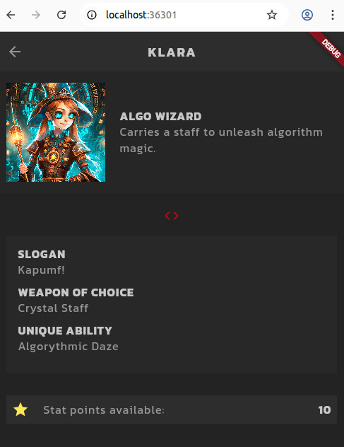

  - post:lesson-54 - actaully use Table for health,attack,defense,skill in stats_table.dart
    - mods to :stateful_widget:StatsTable
    - use of map_function to convert from :podo:stats.statsAsFormatedList to :widget:TableRow 
    - implement onPress/onTap callbacks that modify state (stat points) and update view

    - 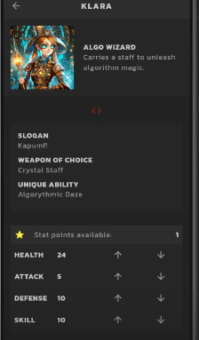

  - post:lesson-55 - filter list of skill  by selected-vocation
    - "availableSkills" - filter list of skill  by selected-vocation
    - create :stateful-widget:SkillList (see screens/profile/skills_list.dart)

    - 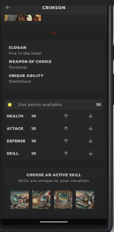
  
  - post:lesson-56 - add yellow box around selected skill (conditional logic and state)
     - file effected , skil_list.dart
     - added selected skill title below "row of skill icons" on bottom of :widget:SkillList

     - 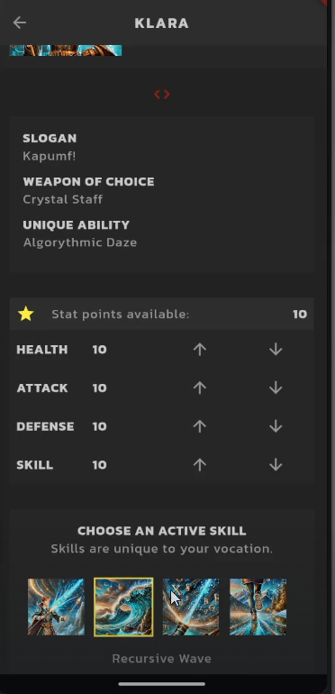

  - post:lesson-57 - added save button (that opens a snackbar/toast confirmation but does not save to database (yet))
    - files effected - profile.dart
     ```dart
        ...
            // save button
            StyledButton(onPressed: () {
              // show snackbar
              ScaffoldMessenger.of(context).showSnackBar(SnackBar(
                content: const StyledHeading('Character saved.'),
                showCloseIcon: true,
                backgroundColor: AppColors.secondaryColor,
                duration: const Duration(seconds: 2),
              ));

            }, child: const StyledHeading('save character')),
            const SizedBox(height: 20),
        ...

     ```
#### nna62_provider_global_state
  - includes lesson-58... lesson-62
  - effected files: 
    - services/character_store.dart // lesson 59
    - main.dart  // lesson 60
    - screens/home/home.dart  // lesson 61
    - screens/create/create.dart // lesson 62
  - create :ChangeNotifier:CharacterStore (see services/character_store.dart)
  - :ChangeNotifier:CharacterStore houses the :List<Character>:"characters" for the app.
  - main.dart uses provider to add :ChangeNotifier:CharacterStore to app's context.
    - `dart pub add provider`
    - (see https://pub.dev/packages/provider )
  


  #### zzz00_namer_adv 
  - src https://dartpad.dev/?id=e7076b40fb17a0fa899f9f7a154a02e8
  - https://github.com/flutter/codelabs/tree/main/namer
  - https://codelabs.developers.google.com/codelabs/flutter-codelab-first#8

  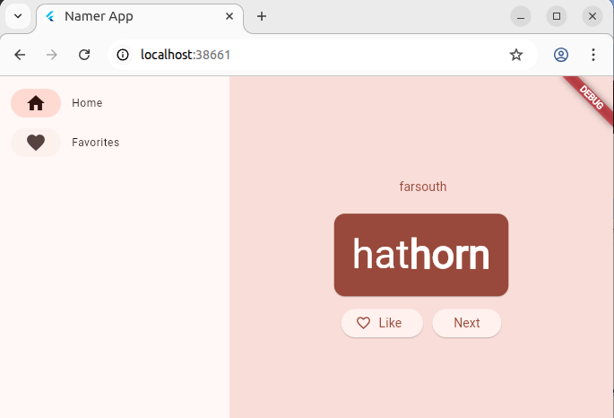